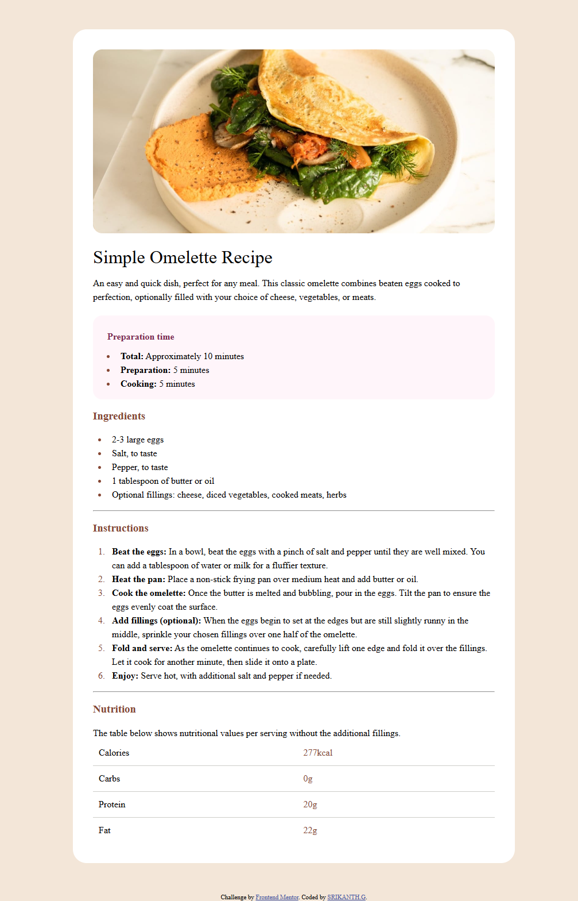
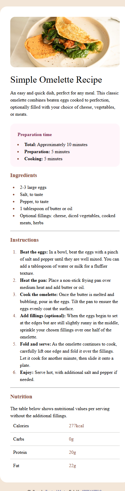

# Frontend Mentor - Recipe page solution

This is a solution to the [Recipe page challenge on Frontend Mentor](https://www.frontendmentor.io/challenges/recipe-page-KiTsR8QQKm). Frontend Mentor challenges help you improve your coding skills by building realistic projects. 

## Table of contents

- [Overview](#overview)
  - [The challenge](#the-challenge)
  - [Screenshot](#screenshot)
  - [Links](#links)
  - [Built with](#built-with)
  - [Useful resources](#useful-resources)
- [Author](#author)

**Note: Delete this note and update the table of contents based on what sections you keep.**

## Overview

This challenge gives you a brand new opportunity to build a fully responsive, visually appealing recipe page from a pre-provided mockup. The idea is to take a static design and convert it into a functional and styled web page using modern web development. This exercise will show your skills in HTML, CSS.

## The challenge

challenge is to build out this recipe page and get it looking as close to the design as possible.

### Screenshot

### Links

- Solution URL: [Add solution URL here](https://your-solution-url.com)
- Live Site URL: [Add live site URL here](https://your-live-site-url.com)

## built-with

- HTML5 schemantic
-CSS
- Flexbox

### Useful resources

- (https://www.w3schools.com/css/css_list.asp) - This helped me for styling list marker. 

## Author

- Frontend Mentor - [@shrikanth-dev](https://www.frontendmentor.io/profile/yourusername)
- LinkedIn - [@G Srikanth](https://www.linkedin.com/in/g-srikanth-gs)

